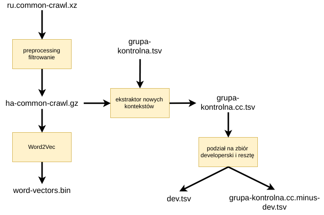
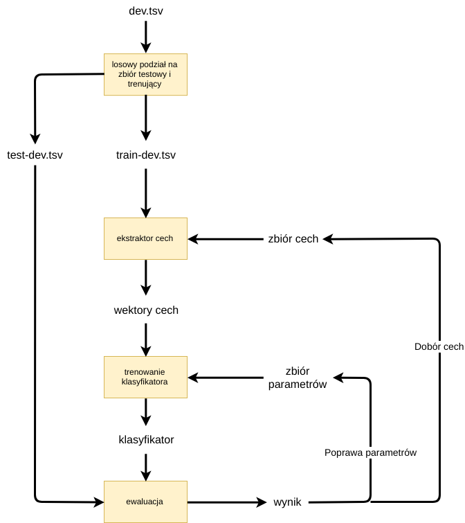
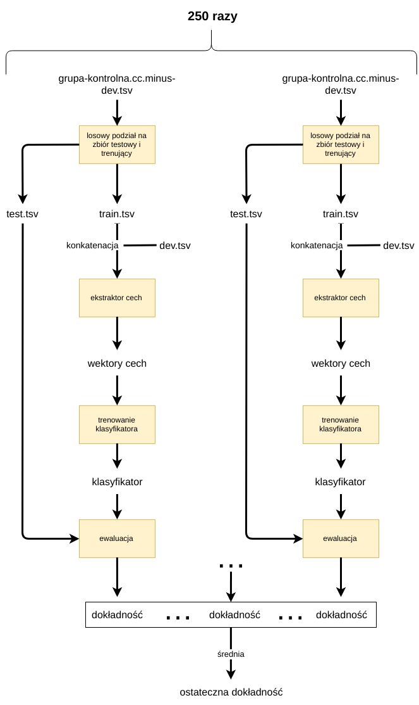
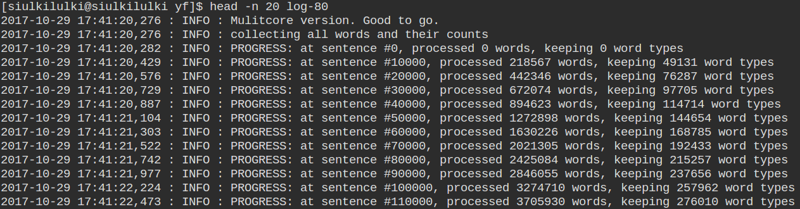
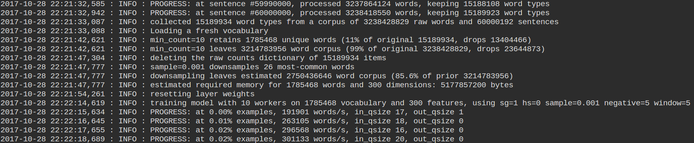
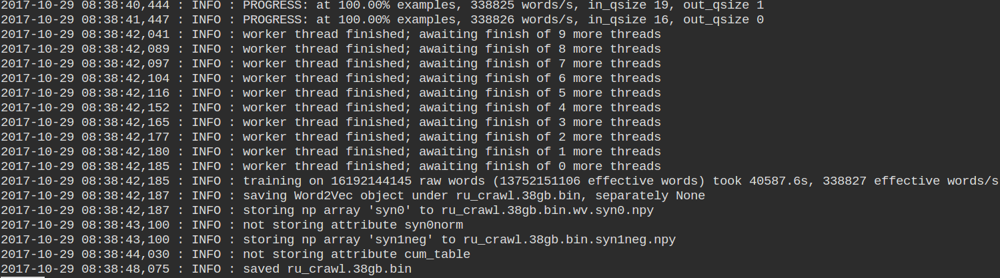
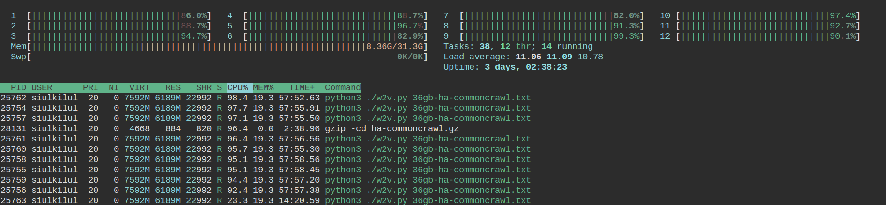
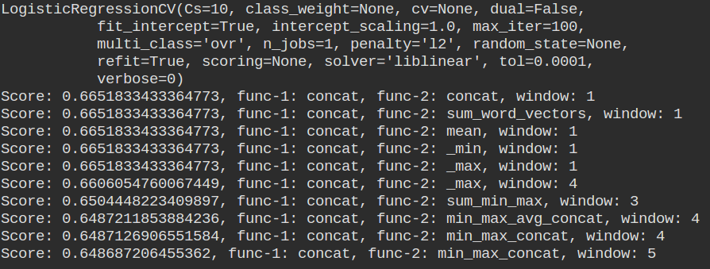
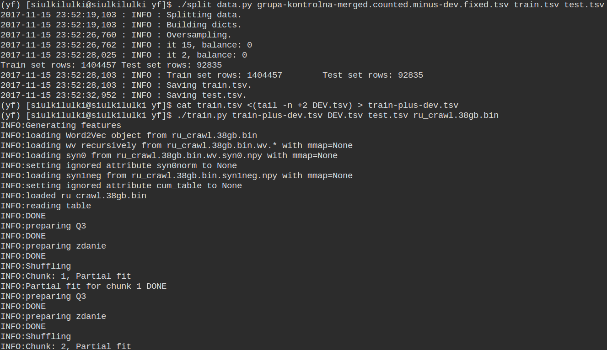

# Cel
  Klasyfikacja (V+на+N4 r. żeń., l. p.) accusativ na frazem i nie frazem

# Zasoby
  Ręcznie annotowane 1087 trigramów
  w formie (V+на+N4 r. żeń., l. p.) accusativ z czego 1078 trigramów
  było unikalnych

# Workflow
## 1. Preprocessing:
### a) grupa-kontrolna.tsv (ręcznie annotowany zbiór)
   + trigram był między '&&&' ,a  '###'
   + poprawione błędy w grupa-kontrolna.tsv typu
     - 4-gram zamiast 3-gram między '&&&', '###'
     - wyczyszczone niechciane znaki typu '(', '<<'

### b) korpus ru.common-crawl.xz
   - pierwotnie był już podzielony na zdania
   - ściągnięty korpus common-crawl języka rosyjskiego, 105GB archiwum xz
     z statmt.org
   - wszystkie liczby zamienione zostały na 'NUMBER', lowercasing,
     pozostawione tylko alphanumeryczne znaki

### c) на-common-crawl.gz
   - z wyczyszczonego archiwum korpusu commmon-crawl
     odfiltrowane zostały wszystkie zdania zawierające 'на' i
     spakowane do 74GB archiwum gzip

### d) gazeta.txt
  - skonkatenowane 3362 pliki rosyjskich gazet w txt
      w jeden 42MB plik txt
  - Wytrenowany został PunktSentenceTokenizer z
      nltk.tokenize.punkt.Tokenizer na tym 42MB pliku.
  - dokonana została segmentacja tego 42MB pliku
  - wszystkie liczby zamienione zostały na 'NUMBER', lowercasing,
     pozostawione tylko alphanumeryczne znaki

#### PunktSentenceTokenizer

PunktSentenceTokenizer używa nienadzorowanego algrytmu
Kiss & Strunk (2006)\* do zbudowania modelu dla skrótów wyrazów,
kolokacji i słów zaczynających zdanie. Potem używa tego modelu,
aby znaleźć koniec i początek zdania.
Wg. http://www.nltk.org/_modules/nltk/tokenize/punkt.html#PunktSentenceTokenizer to rozwiązanie działa dobrze dla wielu Eurpejskich języków

*więcej o Kiss & Strunk pod http://citeseerx.ist.psu.edu/viewdoc/download?doi=10.1.1.85.5017&rep=rep1&type=pdf

### e) Word2Vec
   - wytrenowany na 38GB tekstu rosyjskiego + 42MB gazeta.txt
   - trenowany na 10 cpu
   - rozmiar wektorów 300
   - zignorowane słowa, których liczba wynosi mniej niż 10
   - użyty skip-gram model (więcej pod http://mccormickml.com/2016/04/19/word2vec-tutorial-the-skip-gram-model/)
   - użyte negative sampling (więcej pod http://mccormickml.com/2017/01/11/word2vec-tutorial-part-2-negative-sampling/)
   - maksymalny dystans między bieżącym, a przewidywanym słowem (w zdaniu)
     wynosi 5
   - 5 iteracji na całym korpusie (5 epok)

### f) grupa-kontrolna.cc.tsv (zbieranie nowych kontekstów dla trigramów)
   - Skryptem w pythonie zostały wyekstrahowane z ha-commoncrawl.gz
     nowe konteksty dla trigramów z grupa-kontrolna.tsv
   - wyszło 883877 nowych kontekstów dla trigramów
   - po dodaniu ich do grupa-kontrolna.cc.tsv otrzymaliśmy ich 884965

### h) Podział na zbiór uczący, testowy i developerski
   - 63037 przykładów (w których było 49 unikalnych trigramów)
     zostało odłożone jako zbiór developerski, dev.tsv
   - reszta została użyta do walidacji krzyżowej, i zapiszemy ją jako grupa-kontrolna.cc.minus-dev.tsv

## 2. Ekstrakcja cech
   - lewy kontekst, 5 słów, każde z nich to wektor z Word2Vec'a
   - prawy kontekst, 5 słów, każde z nich to wektor z Word2Vec'a
   - trigram, każde z trzech słów to wektor z Word2Vec'a
   - ostateczny feature vector to konkatenacja wektora lewego kontekstu, wektora prawego kontekstu i wektora trigramu

## 3. Uczenie
   Wykorzystany został Stochastic Gradient Descent z regresją logistyczną.
   Po to aby móc trenować online. Było to niezbędne,
   bo wszystkie dane uczące nie mieściły się w pamięci na raz.
   Wykonana została jedna iteracja na całym korpusie.

   Parametry dla SGDClassifier z regresją logistyczną:
   - learning_rate='optimal'
          eta = 1.0 / (alpha * (t + t0)), gdzie eta to learning rate,
          a t0 jest wybierane na podstawie heurystyki od Leon Botto\*
   - penalty='elasticnet' (kombinacja wypukła L1 i L2)
   - l1_ratio=0.5, (kontroluje kombinację wypukłą między regularyzacją L1, a regularyzacją L2)
   - alpha=0.00015, (używane do obliczania learning_rate)

   \*Więcej pod http://scikit-learn.org/stable/modules/sgd.html#sgd

## 4. Optymalizacja
  - Dla każdej z cech (lewy konteks, trigram, prawy kontekst) sprawdzone zostały na pierwotnej grupa-kontrolna.tsv (1087 wierszy) następujące sposoby tworzenia wektorów, które po konkatenacji dawały ostateczny wektor cech:
    + konkatancja wektorów,
    + konkatenacja wektora z wektorem będącym minimum z wektorów słów i z wektorem będącym maximum z wektorów słów,
    + konkatenacja powyższego ze średnią wektorów słów,
    + suma wektorów
    + średnia wektorów
    + minimum z wektorów słów
    + maximum z wektorów słów
  - okazało się, że najlepiej dla każdej z cech sprawdza się konkatenacja wektorów słów
  - na zbiorze developerskim została dobrana najlepsza alfa, penalty i l1_ratio

## 5. Ewaluacja
  - metodą Monte-Carlo cross-validation (reapeated random sub-sampling
    validation)
  - Za każdym razem grupa-kontrolna.cc.minus-dev.tsv była losowo dzielona na zbiór testowy i zbiór uczący przy czym zadbane było, aby żadne dwa identyczne trigramy o różnych kontekstach nie znalazły się jednocześnie w
zbiorze testowym i zbiorze uczącym. Zbiór testowy średnio był 10 krotnie mniejszy niż zbiór uczący.
  - Zbiór uczący był następnie powiększany o zbiór developerski i na tym powiększonym zbiorze trenowany był klasyfikator, a walidowany był na zbiorze testowym.
  - Proces został powtórzony 250 razy, a ostateczna dokładność była średnią dokładnością z tych 250.
  - Wynik: 0.72 (72% dokładności), poprzedni wynik na samym grupa-kontrolna.tsv bez dodatowych kontekstów z common crawl'a wyniósł 0.665

# Zrzuty ekranu

## Przygotowanie zbiorów i wektorów słów

## Optymalizacja

## Ewaluacja

## Trenowanie Word2Vec

## Jeden z pierwszych protypów

## Ewaluacja

